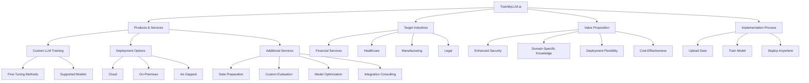
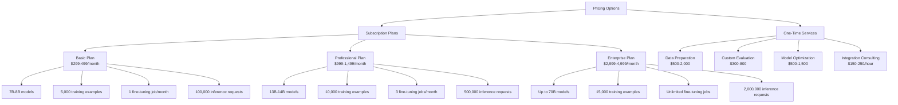

# TrainMyLLM.ai Website Analysis

## Company Overview
- **Mission**: TrainMyLLM.ai aims to democratize access to powerful, secure, and customizable large language models for enterprises of all sizes.
- **Leadership**: Founded by Aayush Gupta, a distributed systems expert with experience at Coupang, Atlassian, Disney+ Hotstar, and Zomato.
- **Industry Experience**: The team brings expertise from major tech companies including Amazon.

## Core Value Proposition
- **Enterprise-Grade LLMs**: Custom AI models trained on business-specific data
- **Key Differentiators**:
  - Enhanced security and privacy (data never leaves client environment)
  - Domain-specific knowledge and accuracy
  - Deployment flexibility (cloud, on-premises, air-gapped)
  - Cost-effectiveness (fixed costs vs. per-token pricing)

## Technical Capabilities

### Fine-Tuning Methods
| Method | Accuracy | Complexity | Best For | Infrastructure Needs |
|--------|----------|------------|----------|---------------------|
| Full Fine-Tuning | 9/10 | 9/10 | Enterprise applications requiring maximum accuracy | High-performance GPU cluster |
| LoRA | 8/10 | 6/10 | Cost-effective fine-tuning with good accuracy | Single high-end GPU |
| QLoRA | 7/10 | 5/10 | Memory-constrained environments | Standard GPU |
| Adapter | 7/10 | 5/10 | Multi-task learning and quick adaptation | Standard GPU |
| Prompt Tuning | 5/10 | 3/10 | Quick experiments and prototyping | CPU or basic GPU |
| P-Tuning v2 | 6/10 | 4/10 | Better prompt tuning performance | Basic GPU |
| SFT | 8/10 | 7/10 | Instruction following and task-specific training | High-end GPU |
| RLHF | 9/10 | 9/10 | Aligning models with human preferences | High-performance GPU cluster |

### Supported Models
- **Llama 4 (Scout/Maverick)**
  - Meta's newest flagship LLM
  - 128K token context window
  - State-of-the-art instruction following
  - Superior reasoning capabilities

- **Llama 3.3 (70B/405B)**
  - Advanced large language model
  - 32K token context window
  - Advanced knowledge capabilities
  - Excellent multilingual support

- **Llama 3.2 (1B/3B/11B Vision/90B Vision)**
  - Enhanced performance in multilingual tasks
  - Strong performance across languages
  - Vision capabilities in larger models

- **Llama 3.1 (8B/70B/405B)**
  - Foundational LLM with strong performance
  - Multiple size options
  - Excellent instruction following

- **Llama 3 (8B/70B)**
  - Versatile language model
  - Strong general capabilities
  - Multiple size options

- **Llama 2 (7B/13B)**
  - Foundational LLM with proven performance
  - Multiple size options
  - Strong community support

## Implementation Process
1. **Upload Data**: 
   - Securely provide knowledge base and proprietary content
   - Supported formats: PDFs, spreadsheets, images, code, presentations
   - Secure data handling with encryption

2. **Train Model**: 
   - Optimization of LLMs for specific data and use cases
   - Hyperparameter tuning
   - Progress tracking

3. **Deploy Anywhere**: 
   - Cloud deployment (scalable and flexible)
   - On-premises deployment (full control over infrastructure)
   - Air-gapped deployment (maximum security for sensitive data)

## Pricing Structure

### Subscription Plans

#### Basic Plan ($299-499/month)
- 7B-8B models (Mistral 7B, Llama-3 8B)
- Up to 5,000 training examples
- 1 fine-tuning job per month
- 100,000 inference requests per month
- Additional features:
  - Web-based model testing interface
  - Basic analytics dashboard
  - Secure, encrypted model storage
  - Standard evaluation metrics

#### Professional Plan ($999-1,499/month)
- 13B-14B models (Phi-3 14B, Llama-2 13B)
- Up to 10,000 training examples
- 3 fine-tuning jobs per month
- 500,000 inference requests per month
- Additional features:
  - Advanced testing and prompt interface
  - Comprehensive analytics and logging
  - Model versioning and A/B testing
  - Custom evaluation scenarios
  - WebSocket API support

#### Enterprise Plan ($2,999-4,999/month)
- Up to 70B models (Llama-3 70B, Mixtral 8x22B)
- Up to 15,000 training examples
- Unlimited fine-tuning jobs
- 2,000,000 inference requests per month
- Additional features:
  - Enterprise-grade security and compliance
  - Advanced hyperparameter optimization
  - Custom model architecture modifications
  - VPC/private deployment options
  - GPU resource reservation
  - SLA guarantees with 99.99% uptime

### Additional Services
- **Data Preparation**: $500-2,000
  - Professional cleaning, formatting, and optimization of training data

- **Custom Evaluation**: $300-800
  - Specialized testing scenarios and metrics tailored to specific domains

- **Model Optimization**: $500-1,500
  - Expert fine-tuning of model parameters for maximum performance

- **Integration Consulting**: $150-250/hour
  - Expert assistance implementing models into existing systems

## Use Cases and Applications

### Document Summarization
- Transform lengthy internal documents, reports, and research into concise summaries
- Benefits:
  - Reduce information overload for executives
  - Focus on company-relevant insights
  - Extract actionable items automatically
- Ideal for: Leadership, Research, Product teams

### Policy & Compliance Q&A
- Immediate, accurate answers about internal policies, procedures, and compliance requirements
- Benefits:
  - Ensure consistent policy application
  - Reduce compliance risks
  - Free up HR and legal resources
- Ideal for: HR, Legal, Compliance teams

### Sales Enablement
- Instant access to competitive insights, product details, and customized sales strategies
- Benefits:
  - Accelerate sales cycles
  - Increase win rates through tailored approaches
  - Improve competitive positioning
- Ideal for: Sales, Marketing, Customer Success teams

### Domain-Specific Knowledge
- Fast, accurate answers from internal R&D, technical documentation, and proprietary research
- Benefits:
  - Accelerate innovation cycles
  - Preserve institutional knowledge
  - Facilitate cross-team knowledge sharing
- Ideal for: Engineering, Research, Product Development teams

### HR & IT Self-Service
- Always-available support system for employee queries about benefits, systems, and processes
- Benefits:
  - Reduce support ticket volume
  - Provide 24/7 assistance
  - Improve employee satisfaction
- Ideal for: HR, IT, Operations teams

### Executive Decision Support
- Synthesize financial, operational, and market data into strategic insights
- Benefits:
  - Accelerate data-driven decisions
  - Highlight critical operational factors
  - Provide scenario analysis
- Ideal for: C-Suite, Directors, Strategic Planning teams

## Case Studies

### Financial Services
- **Challenge**: Managing thousands of compliance documents across multiple regulatory frameworks
- **Solution**: Custom LLM trained on regulatory document library
- **Results**:
  - 85% reduction in research time
  - 93% correct interpretation rate
  - 100% policy adherence

### Healthcare
- **Challenge**: Inefficient clinical documentation and inconsistent treatment protocol adherence
- **Solution**: Custom LLM trained on clinical guidelines, medical records, treatment protocols
- **Results**:
  - 52% reduction in documentation time
  - 91% protocol adherence across facilities
  - 87% physician approval rating

### Manufacturing
- **Challenge**: Knowledge loss as experienced technicians retired, reactive equipment maintenance
- **Solution**: Custom LLM trained on maintenance records, equipment manuals, expert technician videos
- **Results**:
  - 68% improvement in downtime reduction
  - $4.3M annual savings in maintenance costs
  - 95% of expert techniques preserved

### Legal
- **Challenge**: Inefficient analysis of precedent cases and contracts across multiple jurisdictions
- **Solution**: Custom LLM trained on proprietary database of past cases, legal briefs, contract templates
- **Results**:
  - 76% reduction in research time
  - 5.2x faster contract analysis
  - 23% increase in efficiency for billable hours

## Competitive Analysis

### Generic Open-Source LLMs
- **Domain Knowledge**: Limited to general knowledge
- **Data Security**: Self-hosted, secure if properly configured
- **Response Accuracy**: Generic, prone to hallucinations
- **Cost Structure**: Infrastructure costs only
- **Policy Compliance**: No awareness of internal policies

### Commercial API (e.g., GPT-4)
- **Domain Knowledge**: Strong general knowledge, no internal data
- **Data Security**: Data leaves environment, potential risks
- **Response Accuracy**: High general accuracy, but lacks context
- **Cost Structure**: Ongoing API costs, unpredictable billing
- **Policy Compliance**: Generic understanding of regulations

### Fine-Tuned Enterprise LLM
- **Domain Knowledge**: Deep understanding of company-specific context
- **Data Security**: Complete control of data and infrastructure
- **Response Accuracy**: Highly accurate with company terminology
- **Cost Structure**: Fixed costs, predictable scaling
- **Policy Compliance**: Trained on exact policies and procedures

## Business Model Visualization

## Pricing Structure Visualization

## Summary

TrainMyLLM.ai offers a comprehensive solution for enterprises looking to leverage the power of custom large language models. Their focus on security, domain-specific knowledge, deployment flexibility, and cost-effectiveness positions them as a strong contender in the enterprise AI space. With a range of fine-tuning methods, supported models, and pricing options, they cater to businesses of various sizes and needs across multiple industries.

The case studies demonstrate significant ROI across different sectors, with improvements in efficiency, accuracy, and cost savings. The comparison with generic and commercial LLMs highlights the unique value proposition of their custom enterprise solutions.